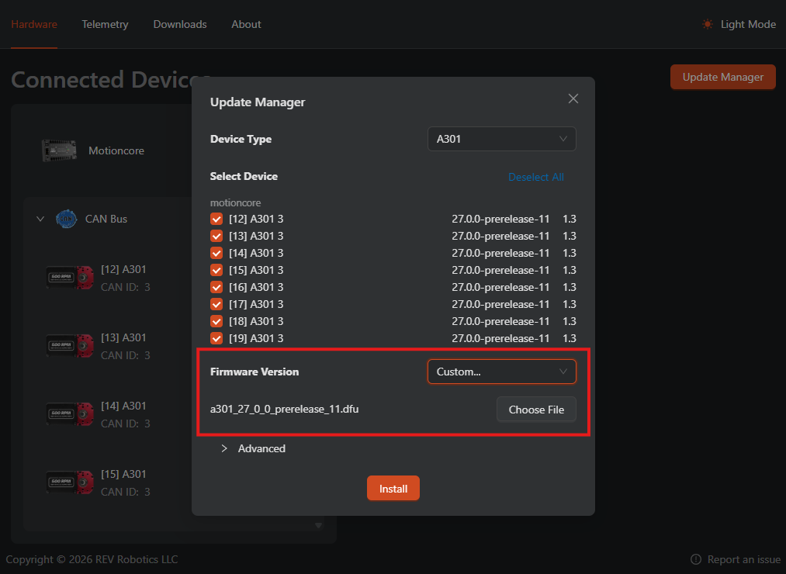

# A301

## Software Resources

### API

The A301 API is available through REVLib and will later be available natively through WPILib in the near future.

Follow the instructions in [REV.md](REV.md) to install the latest version of REVLib.

### Firmware

> [!IMPORTANT]
> A301s must be updated to 27.0.0-prerelease.11 or later before use. REVLib and RHC2 will prevent you from running an A301 with an older version.

The recommend method to update the A301 firmware is through REV Hardware Client 2 running directly on Systemcore. Since Systemcore will likely not be connected to internet, you will need to upload the firmware file to RHC2 using the dialog as shown below.

For downloads and instructions, see [REV.md](REV.md).



The firmware can also be updated from RHC2 on desktop, but a bridging device is required (SPARK Flex, PDH, etc.). To receive the latest firmware in RHC2, enter the following code in the "Downloads" tab of RHC2: `a301-alpha`

## Known Issues

* RHC2 may take a while to startup after bootup
* RHC2 interaction with more than 16 devices connected to Motioncore may be unstable

## Getting Started

Full code docs for the A301 API can be found here: [Java](https://codedocs.revrobotics.com/java/com/revrobotics/spark/a301), [C++](https://codedocs.revrobotics.com/cpp/classfirst_1_1a301_1_1_a301.html)

You can create an A301 object by doing the following:

```java
// Create an A301 object on Motioncore channel 0. The A301's CAN ID must be the default value of 3.
A301 motor = new A301(CANBusMap.CAN_D0);

// Create an A301 object on Motioncore channel 0, with a non-default CAN ID of 5.
A301 motor = new A301(CANBusMap.CAN_D0, 5);
```

To drive the motor, there are individual methods for the different control types:

```java
// Command the motor to a velocity in RPM
motor.setVelocity(100);

// Command the motor to a relative position (multiple rotations)
motor.setPosition(5);

// Command the motor to an absolute position (single rotation)
motor.setAbsolutePosition(0.4, false);

// Command the motor to an absolute position with continuous input (shortest path)
motor.setAbsolutePosition(-0.4, true);

// Command the motor to a specific throttle level 
motor.setThrottle(0.5);
```

The A301 class offers getters to retrieve the status of the device. These will return a Signal object which includes the value and additional information about its validity:

```java
// Get the relative position of the encoder
SmartDashboard.putNumber("position", motor.getRelativeEncoderPosition().get());

// Get the input voltage of the motor
SmartDashboard.putNumber("voltage", motor.getBusVoltage().get());

// Check if the received value is valid before using it
Signal<Double> velocity = motor.getEncoderVelocity();
if (velocity.isValid()) {
    odometry.update(velocity.get());
}
```
